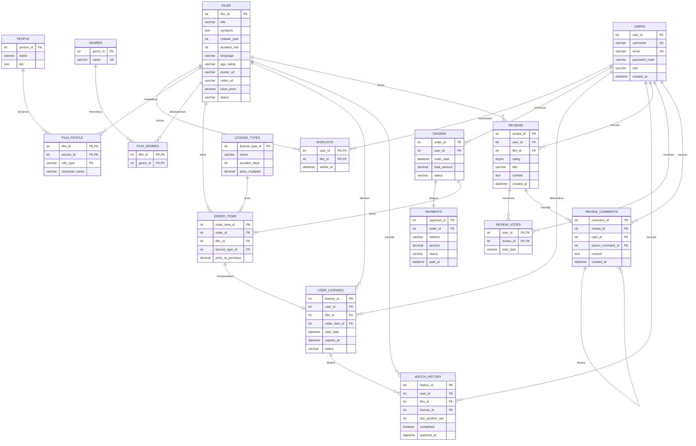

# CineVault

```mermaid
erDiagram
    FILMS {
        int film_id PK
        varchar title
        text synopsis
        int release_year
        int duration_min
        varchar language
        varchar age_rating
        varchar poster_url
        varchar video_url
        decimal base_price
        varchar status
    }

    PEOPLE {
        int person_id PK
        varchar name
        text bio
    }

    GENRES {
        int genre_id PK
        varchar name UK
    }

    USERS {
        int user_id PK
        varchar username UK
        varchar email UK
        varchar password_hash
        varchar role
        datetime created_at
    }

    WISHLISTS {
        int user_id PK,FK
        int film_id PK,FK
        datetime added_at
    }

    FILM_PEOPLE {
        int film_id PK,FK
        int person_id PK,FK
        varchar role_type PK
        varchar character_name
    }

    FILM_GENRES {
        int film_id PK,FK
        int genre_id PK,FK
    }

    LICENSE_TYPES {
        int license_type_id PK
        varchar name
        int duration_days
        decimal price_multiplier
    }

    ORDERS {
        int order_id PK
        int user_id FK
        datetime order_date
        decimal total_amount
        varchar status
    }

    PAYMENTS {
        int payment_id PK
        int order_id FK
        varchar method
        decimal amount
        varchar status
        datetime paid_at
    }

    ORDER_ITEMS {
        int order_item_id PK
        int order_id FK
        int film_id FK
        int license_type_id FK
        decimal price_at_purchase
    }

    USER_LICENSES {
        int license_id PK
        int user_id FK
        int film_id FK
        int order_item_id FK
        datetime start_date
        datetime expires_at
        varchar status
    }

    WATCH_HISTORY {
        int history_id PK
        int user_id FK
        int film_id FK
        int license_id FK
        int last_position_sec
        boolean completed
        datetime watched_at
    }

    REVIEWS {
        int review_id PK
        int user_id FK
        int film_id FK
        tinyint rating
        varchar title
        text content
        datetime created_at
    }

    REVIEW_VOTES {
        int user_id PK,FK
        int review_id PK,FK
        varchar vote_type
    }

    REVIEW_COMMENTS {
        int comment_id PK
        int review_id FK
        int user_id FK
        int parent_comment_id FK
        text content
        datetime created_at
    }

    %% Relasi antar tabel beserta relasi kardinalitas dan labelnya
    USERS ||--o{ WISHLISTS : "menyimpan"
    FILMS ||--o{ WISHLISTS : "diincar"

    FILMS ||--o{ FILM_PEOPLE : "melibatkan"
    PEOPLE ||--o{ FILM_PEOPLE : "berperan"

    FILMS ||--o{ FILM_GENRES : "dikategorikan"
    GENRES ||--o{ FILM_GENRES : "mencakup"

    USERS ||--o{ ORDERS : "membuat"
    ORDERS ||--|| PAYMENTS : "dibayar"
    ORDERS ||--|{ ORDER_ITEMS : "berisi"
    
    FILMS ||--o{ ORDER_ITEMS : "dibeli"
    LICENSE_TYPES ||--o{ ORDER_ITEMS : "jenis"

    ORDER_ITEMS ||--o| USER_LICENSES : "menghasilkan"
    USERS ||--o{ USER_LICENSES : "dilisensikan"
    FILMS ||--o{ USER_LICENSES : "ditonton"

    USER_LICENSES ||--o{ WATCH_HISTORY : "dipakai"
    USERS ||--o{ WATCH_HISTORY : "memiliki"
    FILMS ||--o{ WATCH_HISTORY : "memiliki"

    USERS ||--o{ REVIEWS : "menulis"
    FILMS ||--o{ REVIEWS : "diulas"

    USERS ||--o{ REVIEW_VOTES : "memberi"
    REVIEWS ||--o{ REVIEW_VOTES : "menerima"

    USERS ||--o{ REVIEW_COMMENTS : "menulis"
    REVIEWS ||--o{ REVIEW_COMMENTS : "memiliki"
    REVIEW_COMMENTS ||--o{ REVIEW_COMMENTS : "dibalas"
```
