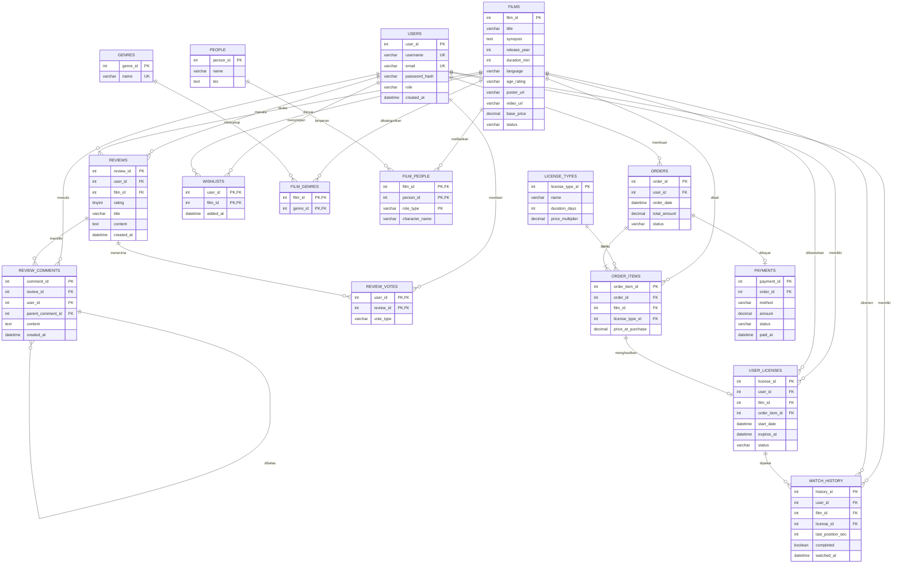

# CineVault

```mermaid
erDiagram
    USERS ||--o{ ORDERS : membuat
    USERS ||--o{ USER_LICENSES : memiliki
    USERS ||--o{ REVIEWS : menulis
    USERS ||--o{ REVIEW_COMMENTS : menulis
    USERS ||--o{ REVIEW_VOTES : memberi
    USERS ||--o{ WISHLISTS : menyimpan
    USERS ||--o{ WATCH_HISTORY : memiliki

    FILMS ||--o{ FILM_GENRES : dikategorikan
    GENRES ||--o{ FILM_GENRES : mencakup
    FILMS ||--o{ FILM_PEOPLE : melibatkan
    PEOPLE ||--o{ FILM_PEOPLE : berperan
    FILMS ||--o{ ORDER_ITEMS : dibeli
    FILMS ||--o{ USER_LICENSES : dilisensikan
    FILMS ||--o{ REVIEWS : diulas
    FILMS ||--o{ WISHLISTS : diincar
    FILMS ||--o{ WATCH_HISTORY : ditonton

    LICENSE_TYPES ||--o{ ORDER_ITEMS : jenis
    ORDERS ||--|{ ORDER_ITEMS : berisi
    ORDERS ||--o| PAYMENTS : dibayar
    ORDER_ITEMS ||--o| USER_LICENSES : menghasilkan
    USER_LICENSES ||--o{ WATCH_HISTORY : dipakai
    REVIEWS ||--o{ REVIEW_COMMENTS : memiliki
    REVIEWS ||--o{ REVIEW_VOTES : menerima
    REVIEW_COMMENTS ||--o{ REVIEW_COMMENTS : dibalas

    USERS {
        int user_id PK
        varchar username UK
        varchar email UK
        varchar password_hash
        varchar role
        datetime created_at
    }
    FILMS {
        int film_id PK
        varchar title
        text synopsis
        int release_year
        int duration_min
        varchar language
        varchar age_rating
        varchar poster_url
        varchar video_url
        decimal base_price
        varchar status
    }
    GENRES {
        int genre_id PK
        varchar name UK
    }
    FILM_GENRES {
        int film_id PK,FK
        int genre_id PK,FK
    }
    PEOPLE {
        int person_id PK
        varchar name
        text bio
    }
    FILM_PEOPLE {
        int film_id PK,FK
        int person_id PK,FK
        varchar role_type PK
        varchar character_name
    }
    LICENSE_TYPES {
        int license_type_id PK
        varchar name
        int duration_days
        decimal price_multiplier
    }
    ORDERS {
        int order_id PK
        int user_id FK
        datetime order_date
        decimal total_amount
        varchar status
    }
    ORDER_ITEMS {
        int order_item_id PK
        int order_id FK
        int film_id FK
        int license_type_id FK
        decimal price_at_purchase
    }
    PAYMENTS {
        int payment_id PK
        int order_id FK
        varchar method
        decimal amount
        varchar status
        datetime paid_at
    }
    USER_LICENSES {
        int license_id PK
        int user_id FK
        int film_id FK
        int order_item_id FK
        datetime start_date
        datetime expires_at
        varchar status
    }
    WATCH_HISTORY {
        int history_id PK
        int user_id FK
        int film_id FK
        int license_id FK
        int last_position_sec
        boolean completed
        datetime watched_at
    }
    REVIEWS {
        int review_id PK
        int user_id FK
        int film_id FK
        tinyint rating
        varchar title
        text content
        datetime created_at
    }
    REVIEW_COMMENTS {
        int comment_id PK
        int review_id FK
        int user_id FK
        int parent_comment_id FK
        text content
        datetime created_at
    }
    REVIEW_VOTES {
        int user_id PK,FK
        int review_id PK,FK
        varchar vote_type
    }
    WISHLISTS {
        int user_id PK,FK
        int film_id PK,FK
        datetime added_at
    }
```
